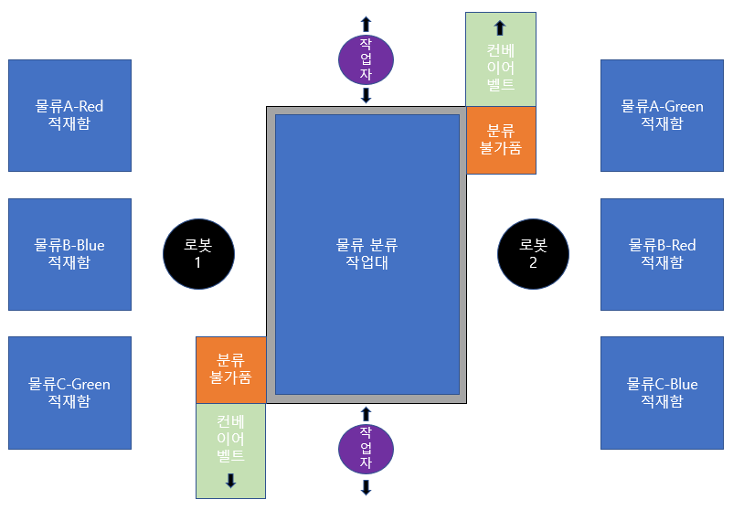

# Proj_Franka_panda_cobot_task_in_mujoco_simulator
* Update: 2026.09.01.

## 1. Description
* **개요:** MuJoCo 환경 기반 Franka Emika Panda 로봇을 활용한 객체 인식 알고리즘 적용 및 HRC(인간-로봇 협업) 물류 분류 시스템 구현
* **목표:** MuJoCo 시뮬레이터와 ROS2를 기반으로 Franka Emika Panda 로봇팔을 제어하고, 객체 인식 및 Pick-and-Place 기능의 구현 프로세스 이해
---

## 2. 작업 공간

---

## 3. 환경
* **OS:** Ubuntu 22.04 LTS
* **Framework:** ROS2 Humble
* **Python versioin:** 3.10(conda 가상환경)
---

## 4. Pre-to-do
```bash
# 1. Conda 가상환경 생성 (약 2~3분 소요)
conda env create -f environment.yaml

# 2. 가상환경 활성화
conda activate ros2_mujoco_panda_py3_10

# 3. Python 버전 확인 (Python 3.10.x 출력 확인)
python --version
```

### 💡 구성 패키지/라이브러리별 상세 역할 및 선정 이유
| 구분 | 패키지명 | 상세 역할 및 프로젝트 내 활용 목적 |
| :--- | :--- | :--- |
| **기반 환경** | `python=3.10` | Ubuntu 22.04 LTS 및 ROS2 Humble의 공식 표준 Python 버전으로, ROS2 C-Extension 모듈과의 바이너리 호환성을 완벽히 보장합니다. |
| **수치 연산** | `numpy>=1.24.0,<2.0.0` | 7-자유도 로봇 관절 상태, 3D 좌표, Depth 맵의 고속 다차원 배열 연산을 처리합니다. (NumPy 2.x의 ABI 호환성 이슈 방지를 위해 1.x로 제한) |
| | `scipy>=1.10.0` | DLS(Damped Least Squares) 수치적 역기구학(IK) 솔버 및 5차 다항식 궤적 보간을 위한 고차 수학 연산을 담당합니다. |
| | `pyyaml` | 시스템 설정 파일(`logistics_config.yaml`)을 로드하고 파싱하는 데 사용됩니다. |
| **물리 엔진** | `mujoco>=3.6.0` | DeepMind의 고속 물리 엔진입니다. 1kHz(1ms) 주기 정밀 동역학 계산, 관절 제어, 물품 파지 마찰력 시뮬레이션 및 OpenGL 오프스크린 렌더링을 수행합니다. |
| **AI / 강화학습** | `torch>=2.0.0` (PyTorch) | 심층 신경망 모델 설계, 텐서 연산 및 GPU(CUDA) 가속 추론을 지원합니다. Phase 10의 PPO 정책망 학습 및 실시간 제어에 활용됩니다. |
| | `gymnasium>=0.29.0` | 표준 강화학습 환경 인터페이스(`reset()`, `step()`, Action/Observation Space)를 제공하여 시뮬레이터와 학습 알고리즘을 연결합니다. |
| | `stable-baselines3>=2.2.0` | 검증된 Multi-Agent PPO(Proximal Policy Optimization) 강화학습 알고리즘 및 분산 병렬 학습 환경(`SubprocVecEnv`)을 제공합니다. |
| **비전 / 3D 처리** | `opencv-python>=4.8.0` | Wrist 카메라의 실시간 RGB 영상 처리, 물류 색상/형상 인식(HSV/Bounding Box) 및 영상 디버깅에 사용됩니다. |
| | `open3d>=0.17.0` | Wrist Depth 영상을 3D Point Cloud로 복원하고, 적재함 부피 적분 및 실시간 차지율(%)을 정밀 계산하는 3D 기하 처리 라이브러리입니다. |
| | `transforms3d>=0.4.1` | 3차원 공간상의 쿼터니언(Quaternion), 회전 행렬(Rotation Matrix), 오일러각(Euler Angle) 간의 상호 변환을 담당합니다. |
| **빌드 & 도구** | `colcon-common-extensions` | ROS2 워크스페이스의 다중 패키지 빌드(`colcon build`), 의존성 자동 정렬 및 테스트를 수행하는 ROS2 공식 빌드 도구입니다. |
| | `setuptools==58.2.0` | 상위 setuptools 버전에서 ROS2 Python 패키지 빌드 시 발생하는 `EasyInstallDeprecationWarning` 및 빌드 에러를 원천 차단하기 위해 안정화된 버전으로 고정합니다. |
| | `rich` | 터미널 콘솔에 컬러 로그, 표(Table), 진행률 바(Progress Bar)를 미려하게 출력하여 상태 모니터링 가독성을 높입니다. |
| | `matplotlib` | 5차 다항식 S-Curve 가감속 프로파일, 센서 데이터 계측치 및 강화학습 보상 곡선을 시각화하고 분석할 때 사용합니다. |
---

## 5. Reference
* https://github.com/google-deepmind/mujoco_menagerie.git
---