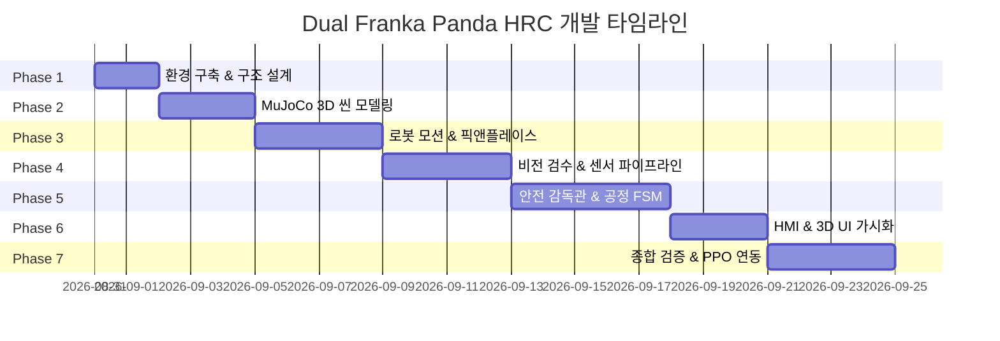

# [로드맵] Franka Panda 듀얼 협동로봇 조립 공정 및 안전 시뮬레이션 시스템 개발 계획

* **문서 번호**: ROADMAP-HRC-20260831-01
* **작성일**: 2026-08-31
* **버전**: v1.0.0
* **개발 환경**: Windows 10 (64-bit), Python 3.10+, MuJoCo 3.x, Gymnasium

---

## 1. 프로젝트 개요 및 아키텍처 전략

### 1.1 프로젝트 목표
* 2대의 Franka Emika Panda 협동로봇과 1명의 작업자가 공존하는 조립 공정 물리 시뮬레이션 환경 구축
* 부품/완성품 자동 품질 검수 및 픽앤플레이스 자동화
* ISO 10218 / ISO/TS 15066 안전 규격을 만족하는 다계층 안전 인터록(LiDAR, Depth Camera, HMI 스위치) 구현
* 향후 **PPO(Proximal Policy Optimization) 강화학습** 도입을 위한 **Gymnasium 표준 인터페이스** 기반 아키텍처 수립

### 1.2 시스템 소프트웨어 아키텍처
ROS의 통신 오버헤드를 배제하고 초고속 시뮬레이션 및 강화학습 병렬 처리가 가능한 **Gymnasium + In-Process Python + MuJoCo C API 직결 구조**를 채택합니다.

```
 ┌───────────────────────────────────────────────────────────────────────────┐
 │                      DualFrankaHRCEnv (Gymnasium 표준)                    │
 │                                                                           │
 │   • reset()        : 부품 상태/작업자 무작위 초기화                         │
 │   • step(action)   : 물리 엔진 스텝 전진 (mj_step)                         │
 │   • get_obs()      : 조인트 상태, Depth Map, 2D LiDAR 계측치              │
 │   • compute_reward(): 조립 성공 가점(+), 안전 구역 침범 감점(-)             │
 └─────────────────────────────────────┬─────────────────────────────────────┘
                                       │
     ┌─────────────────────────────────┴─────────────────────────────────┐
     ▼                                                                   ▼
[ 1단계: Rule-based Baseline (현재) ]                       [ 2단계: RL PPO 도입 (확장) ]
 • FSM 공정 관리자 + 수치적 IK 제어기                          • Stable-Baselines3 PPO Policy
 • 안전 감독관(Safety Supervisor) 인터록                       • 동적 장애물 회피 및 적응형 모션 학습
```

---

## 2. 단계별 마일스톤 (Milestones Overview)

| 단계 (Phase) | 마일스톤 명칭 | 주요 산출물 | 예상 기간 |
| :--- | :--- | :--- | :---: |
| **Phase 1** | 개발 환경 구축 & 구조 설계 | 가상환경, `requirements.txt`, 모듈식 디렉토리 스켈레톤 | 1~2일 |
| **Phase 2** | MuJoCo 3D 가상 씬 & 설정 모델링 | `configs/config.yaml`, `scene_dual_panda.xml` (로봇 2대, 작업대, 6개 구역, 센서) | 2~3일 |
| **Phase 3** | 로봇 모션 제어 & Pick & Place | IK 솔버, 5차 다항식 궤적 생성기, 그리퍼 제어기 | 3~4일 |
| **Phase 4** | 비전 검수 & 센서 파이프라인 | Depth 품질 검수 모듈, 2D LiDAR 레이캐스터, 손 간섭 감지기 | 3~4일 |
| **Phase 5** | 안전 감독관 & 공정 FSM 구축 | Robot1/Worker/Robot2 상태 머신, ISO/TS 15066 SSM, Undo, 10분 셧다운 | 4~5일 |
| **Phase 6** | HMI 가상 제어반 & 3D UI 가시화 | HMI 스위치 4종, 3D 안전 구역(Warning/Danger) 렌더링, HUD 대시보드 | 2~3일 |
| **Phase 7** | 종합 검증, KPI 평가 & PPO 연동 | 10대 검증 시나리오 테스트, 블랙박스 로깅, PPO 학습 파이프라인 | 3~4일 |

---

## 3. 상세 단계별 개발 계획 (Detailed Action Plan)

### 📌 Phase 1: 개발 환경 구축 및 프로젝트 템플릿 구조화
* **목표**: Windows 10 환경에 최적화된 Python 가상환경을 구축하고 모듈 간 느슨한 결합(Loose Coupling)을 지원하는 디렉토리 스켈레톤을 생성합니다.
* **세부 작업**:
  1. Python 3.10+ 기반 가상환경(`venv` 또는 `conda`) 생성 및 의존성 라이브러리 설치 (`mujoco`, `gymnasium`, `numpy`, `scipy`, `opencv-python`, `open3d`, `torch`, `stable-baselines3`, `pyyaml`, `matplotlib`, `rich`).
  2. 루트 디렉토리에 `requirements.txt` 파일 생성.
  3. 모듈식 디렉토리 스켈레톤 생성:
     ```text
     ├── configs/             # 설정 파일 디렉토리
     ├── documents/           # PRD, 시나리오, 로드맵 문서
     ├── model/               # MJCF XML 및 3D 메시 파일
     ├── src/
     │   ├── env/             # Gymnasium 표준 DualFrankaHRCEnv 클래스
     │   ├── controllers/     # IK, Trajectory Generator, Gripper 제어
     │   ├── vision/          # Depth 검수, Point Cloud 처리
     │   ├── safety/          # 2D LiDAR 모니터링, SSM 안전 거리 계산, Supervisor
     │   ├── fsm/             # Robot 1, Robot 2, Worker FSM
     │   ├── hmi/             # HMI 버튼 이벤트, 3D Overlay 가시화
     │   └── utils/           # 설정 로더, 로깅, 수학 유틸리티
     └── tests/               # 단위/통합 테스트
     ```

---

### 📌 Phase 2: MuJoCo 3D 가상 씬 및 설정 모델링
* **목표**: 시스템 전체의 중앙 기준이 되는 `configs/config.yaml`을 정의하고, 이를 기반으로 PRD 작업 공간 레이아웃 명세를 반영한 통합 `scene_dual_panda.xml`을 완성합니다.
* **세부 작업**:
  1. **중앙 설정 파일 작성 (`configs/config.yaml`)**:
     * 듀얼 로봇 베이스 위치/자세, 6개 작업/적재 구역 3D 좌표 및 크기, 센서(카메라/LiDAR) 사양, 안전 임계치(10%, 90%, 10분 등) 정의.
  2. **Dual Robot 배치**: `model/franka_emika_panda` 모델을 기반으로 `config.yaml`에 정의된 로봇 1(공급)과 로봇 2(배출) 베이스 좌표 배치.
  3. **작업 공간 및 6대 구역 모델링**:
     * 중앙 작업대 테이블 지오메트리
     * 상단 3개 구역: `부품 적재함`, `불량품 적재함(공용)`, `완성품 적재함`
     * 하단 3개 구역: `부품 대기 공간`, `작업자 작업 공간`, `검수 공간`
  4. **작업 대상물(Objects) 정의**:
     * 원자재 부품 (정상/불량 형상 변형 파라미터 지원)
     * 조립 완성품 모델
  5. **센서 마운팅**:
     * 각 로봇 EE(End-Effector) 중앙에 Wrist `<camera>`(Depth 획득용) 장착
     * 가상 2D Safety LiDAR 센서 기준 위치 정의
  6. **설정 로더(`config_loader.py`) 작성 및 MuJoCo Viewer 검증**:
     * Python 설정 로더 모듈 구현 및 씬 지오메트리 간섭/좌표 일치 검사 수행.

---

### 📌 Phase 3: 로봇 모션 제어 및 픽앤플레이스 파이프라인
* **목표**: 진동과 급가속 없는 5차 다항식 궤적 생성 및 Damped Least Squares IK 제어기 구현.
* **세부 작업**:
  1. **DLS 기반 수치적 IK 솔버**: 7-DoF Franka Panda 기구학 오차 $\le 1\text{mm}$ 수준 제어.
  2. **궤적 생성기(Trajectory Planner)**: Task Space 상에서 5차 다항식(Quintic Polynomial) 보간으로 부드러운 가감속 모션 생성.
  3. **그리퍼 액추에이션 로직**: 접촉력(Contact Force) 피드백 기반 부품 파지 및 릴리즈.
  4. **기본 픽앤플레이스 루틴**: Approach → Descend → Grasp → Lift → Transfer → Place → Release → Return to Home.

---

### 📌 Phase 4: 비전 및 안전 센서 파이프라인 구축
* **목표**: 합성 Depth 데이터 전처리 및 불량 판별, 2D LiDAR 레이캐스팅 안전 영역 감시 구현.
* **세부 작업**:
  1. **Wrist Depth Camera 파이프라인**:
     * MuJoCo Depth 버퍼 렌더링 → 3D Point Cloud 변환 및 평면 보정.
     * 부품/완성품 치수/형상 불량 검수 알고리즘 (양품/불량 플래그 출력).
  2. **2D LiDAR 가상 센서 모듈**:
     * MuJoCo 레이캐스팅(Ray-casting)을 이용한 180도/360도 거리 스캔.
     * 작업자 및 제3자의 경고 구역(Warning Zone), 위험 구역(Danger Zone) 침범 실시간 계측.
  3. **Place Zone 동적 손 간섭 감지**:
     * `부품 대기 공간` 및 `검수 공간` 하강 전 카메라 ROI 내 움직임/손 감지 인터록.

---

### 📌 Phase 5: 안전 감독관(Safety Supervisor) 및 FSM 공정 구축
* **목표**: 듀얼 로봇과 작업자 간 유기적 협업 상태 머신 구현 및 ISO/TS 15066 안전 인터록 통합.
* **세부 작업**:
  1. **계층적 상태 머신(FSM)**:
     * **Robot 1 FSM**: `IDLE` → `PICK_PART` → `INSPECT` → `PLACE_BUFFER / PLACE_DEFECT` → `WAIT_EMPTY`
     * **Worker Mock Agent**: `WAIT_BUFFER` → `TAKE_PART` → `ASSEMBLE` → `PLACE_INSPECTION`
     * **Robot 2 FSM**: `WAIT_INSPECTION` → `INSPECT` → `PLACE_FINISHED / PLACE_DEFECT`
  2. **안전 감독관(Safety Supervisor)**:
     * **SSM 모드**: 경고 구역 침범 시 속도 감속($\le 250\text{mm/s}$), 위험 구역 침범 시 즉각 Category 1 정지.
     * **손 간섭 일시정지**: 안착 영역 손 감지 시 안전 높이 정지 대기 후 이탈 시 자동 재개.
  3. **예외 상황 처리**:
     * **뒤로가기(Undo)**: Undo 스위치 입력 시 상태 롤백 및 로봇 1 신규 부품 재공급.
     * **작업자 이탈 타이머**: 부재 감지 시 일시정지 → 10분 경과 시 자동 전원 Off(`Auto-Shutdown`).
     * **재고 알림**: 부품 10% 잔여 / 적재함 90% 만재 시 `[MES_ALERT]` 이벤트 발행.

---

### 📌 Phase 6: HMI 가상 제어반 및 3D UI 가시화
* **목표**: 직관적인 3D 안전 영역 시각화 및 제어반 인터페이스 구축.
* **세부 작업**:
  1. **HMI 제어반**: `On/Off`, `Start/Stop`, `Undo`, `E-Stop` 키보드/GUI 스위치 인터페이스.
  2. **3D 뷰어 안전 구역 오버레이**:
     * 경고 구역(노란색 바운더리) 및 위험 구역(빨간색 바운더리) 실시간 렌더링.
  3. **HUD 상태 대시보드**:
     * 공정 단계(FSM), 부품 잔여율(%), 불량률(%), 시스템 알림 메시지 실시간 표출.

---

### 📌 Phase 7: 종합 통합 검증, KPI 평가 & PPO 강화학습 도입
* **목표**: PRD KPI 5대 항목 검증 및 PPO 강화학습 파이프라인 연계.
* **세부 작업**:
  1. **종합 시나리오 100 사이클 연속 가동 테스트**.
  2. **안전성 및 예외 검증**:
     * 비상 정지 응답 시간 ($\le 10\text{ms}$) 및 완전 제동 시간 ($\le 150\text{ms}$) 계측.
     * 손 간섭 100회 테스트 (충돌 0건).
     * Undo 복구율 ($100\%$) 및 10분 작업자 이탈 Auto-Off 검증.
  3. **PPO 강화학습 연계 검증**:
     * `DualFrankaHRCEnv` 환경을 `Stable-Baselines3 PPO`에 연결하여 정책 학습 테스트 (예: 동적 장애물 회피 궤적 최적화).
  4. **최종 개발 및 검증 보고서 작성**.

---

## 4. 비기능 요구사항(NFR) 및 기술 표준 준수 체크리스트

* [ ] **1kHz 제어 주기 준수** (MuJoCo 타임스텝 $\Delta t = 0.001\text{s}$)
* [ ] **비전 지연 시간 $\le 33\text{ms}$** (30 FPS 이상 유지)
* [ ] **ISO/TS 15066 SSM 안전 거리 공식 $S_p$ 동적 계산 반영**
* [ ] **Fail-Safe 인터록 구조** (통신 두절/센서 오류 시 안전 정지)
* [ ] **밀리초 단위 타임스탬프 블랙박스 로깅 (`.jsonl` / `.csv`)**
* [ ] **Headless 모드 지원** (CI/CD 자동화 배치 테스트)

---

## 5. 실행 로드맵 타임라인 (예시)


